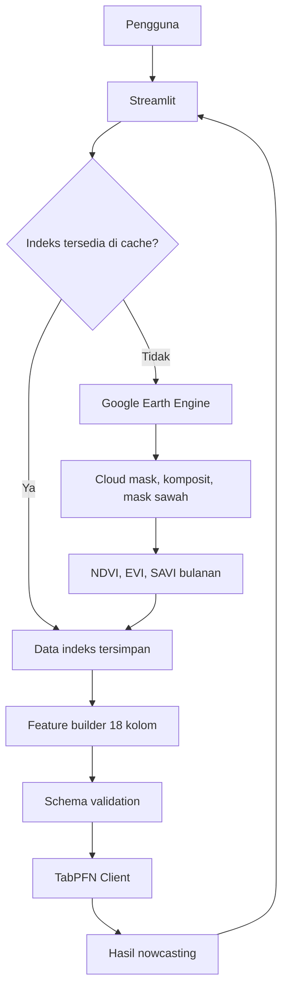

# Spesifikasi Produk dan Deployment Nowcasting Produksi Padi

Dokumen ini menjelaskan produk yang akan dibangun, alur pengguna, mekanisme data dan model, isi setiap halaman Streamlit, struktur project, scope, serta daftar implementasi. Dokumen ini menjadi acuan utama untuk pengerjaan aplikasi.

---

## 1. Nama dan tujuan produk

Nama produk yang dapat digunakan pada proposal dan antarmuka:

> **Sistem Nowcasting Produksi Padi Jawa Timur Berbasis Citra Satelit**

Alternatif judul yang lebih mudah dipahami audiens umum:

> **Sistem Prediksi Produksi Padi Bulanan Berbasis Citra Satelit**

Kata *prediksi* pada judul merujuk pada keluaran model regresi. Penjelasan metodologi tetap wajib menyatakan bahwa model menggunakan citra bulan target dan menghasilkan estimasi produksi untuk bulan tersebut.

Tujuan produk adalah memberikan estimasi awal produksi padi bulanan menggunakan kondisi vegetasi yang sudah teramati melalui Sentinel-2. Produk ditujukan untuk pengguna seperti pemerintah daerah, dinas pertanian, peneliti, atau pihak lain yang membutuhkan informasi produksi lebih cepat sebelum angka resmi tersedia.

Produk mendukung lima kabupaten:

- Bojonegoro.
- Jember.
- Lamongan.
- Ngawi.
- Tuban.

---

## 2. Definisi nowcasting

Satu hasil nowcasting dibuat untuk satu kabupaten dan satu bulan target.

Model menggunakan:

```text
Indeks vegetasi bulan target
+ indeks satu bulan sebelumnya
+ indeks dua bulan sebelumnya
+ informasi musim/bulan
+ identitas kabupaten
-> estimasi produksi bulan target
```

Contoh:

```text
Kabupaten target : Ngawi
Bulan target     : Agustus 2026
Data satelit     : Juni, Juli, Agustus 2026
Output           : Estimasi produksi Agustus 2026
```

Bulan target harus sudah memiliki citra yang cukup. Secara default, aplikasi hanya mengizinkan bulan kalender yang sudah selesai agar komposit bulanan konsisten dengan data training.

### 2.1 Aturan penyajian hasil

Hasil untuk bulan historis harus tetap memakai tanggal aslinya. Jangan menggeser label April–Agustus menjadi September–Januari atau menyajikannya sebagai keluaran untuk bulan yang belum memiliki citra. Perubahan label tersebut membuat klaim produk tidak sesuai dengan input yang dipakai model dan membuat evaluasi tidak sah.

Untuk presentasi lomba, gunakan framing yang kuat tetapi akurat:

> Sistem menghasilkan prediksi model untuk produksi bulan target berdasarkan pengamatan satelit terbaru, sebelum angka resmi tersedia.

Istilah yang boleh digunakan pada UI dan proposal:

- Prediksi produksi bulan target.
- Estimasi awal produksi.
- Nowcasting produksi padi.
- Sistem prediksi berbasis citra satelit.

Halaman metodologi wajib menjelaskan bahwa citra bulan target digunakan sebagai input.

---

## 3. Nilai produk bagi pengguna

Produk membantu pengguna:

- Mendapatkan estimasi produksi bulan terbaru.
- Melihat perubahan kondisi vegetasi selama tiga bulan.
- Membandingkan estimasi beberapa bulan historis.
- Mengetahui wilayah atau bulan dengan kualitas citra kurang memadai.
- Mengunduh hasil dalam format CSV untuk analisis lanjutan.

Hasil model adalah point estimate dalam ton. Produk tidak menampilkan confidence score atau interval ketidakpastian yang belum dibangun dan divalidasi.

---

## 4. Alur pengguna utama

```text
Pengguna membuka aplikasi
-> memilih kabupaten
-> memilih tahun dan bulan target
-> menekan tombol Buat Estimasi
-> aplikasi mencari indeks pada cache
-> jika belum ada, aplikasi mengambil data dari GEE
-> aplikasi melakukan preprocessing
-> aplikasi membentuk 18 fitur
-> TabPFN menghasilkan estimasi
-> aplikasi menampilkan hasil dan tombol unduh
```

Pengguna tidak perlu:

- Mengunggah data spasial.
- Mengunggah citra.
- Mengisi NDVI/EVI/SAVI secara manual.
- Menjalankan notebook.
- Memilih model.
- Memahami feature engineering.

---

## 5. Arsitektur sistem



Prinsip utama:

- Data historis yang sudah tersedia tidak dihitung ulang.
- Data bulan baru diambil otomatis dari GEE.
- TabPFN di-fit satu kali ketika aplikasi mulai.
- Satu atau beberapa baris fitur dapat dikirim dalam satu `predict()`.
- PostgreSQL dapat digunakan untuk menyimpan indeks, hasil estimasi, dan riwayat pemrosesan.

---

## 6. Mekanisme cache dan GEE

### 6.1 Cache historis

File berikut sudah tersedia:

```text
Deployment/historis_index.csv
```

File tersebut berisi indeks bulanan Maret 2019–Desember 2024 untuk lima kabupaten. File dipakai sebagai:

- Sumber cepat untuk periode historis.
- Referensi validasi hasil GEE.
- Cadangan demo ketika GEE bermasalah.

### 6.2 Pengambilan otomatis dari GEE

Jika periode yang dibutuhkan belum ada di cache, aplikasi menjalankan modul GEE secara otomatis:

```text
Tentukan bulan target, t-1, t-2
-> ambil Sentinel-2
-> cloud masking
-> buat komposit per bulan
-> terapkan mask sawah
-> hitung NDVI/EVI/SAVI
-> agregasi per kabupaten
-> validasi hasil
```

Semua proses dipanggil dari Streamlit. Modul GEE ditempatkan terpisah dari UI agar mudah diuji dan dipelihara.

### 6.3 Cache runtime

Gunakan `st.cache_data` untuk menyimpan hasil permintaan GEE yang sama selama aplikasi hidup. Cache runtime mengurangi query berulang, tetapi tidak dianggap sebagai penyimpanan permanen.

Hasil indeks baru disimpan ke PostgreSQL agar tidak hilang ketika container Cloud Run berhenti. Cloud Storage tetap dapat digunakan untuk file spasial atau export berukuran besar.

### 6.4 Database

Database yang disarankan adalah PostgreSQL melalui Supabase atau Cloud SQL. Database menyimpan data tabular, bukan raster Sentinel-2 mentah.

Tabel minimum:

```text
monthly_indices
├── kabupaten
├── period
├── ndvi_mean
├── evi_mean
├── savi_mean
├── image_count
├── source
├── quality_status
└── created_at

prediction_results
├── id
├── kabupaten
├── target_period
├── estimated_production_ton
├── model_version
├── index_source
├── input_features_json
├── quality_status
├── processing_seconds
└── created_at
```

Pasangan `kabupaten + period` pada `monthly_indices` harus unik. Sebelum memanggil GEE, aplikasi memeriksa tabel ini. Hasil baru dari GEE di-upsert setelah lolos quality gate.

---

## 7. Mekanisme model

Model menggunakan `TabPFNRegressor` dari `tabpfn_client`.

Artifact utama:

```text
Artefak_Deployment/X_train.csv
Artefak_Deployment/y_train_asli.csv
Artefak_Deployment/tabpfn_best_params.joblib
Deployment/model_config.json
Deployment/validation_reference.json
Artefak_Deployment/metadata.json
```

Saat aplikasi mulai:

```text
Baca X_train dan y_train
-> validasi 290 baris dan 18 fitur
-> baca best params
-> fit TabPFN Client menggunakan token deployment
-> cache model dengan st.cache_resource
```

Saat pengguna membuat estimasi:

```text
Bentuk satu baris fitur
-> validasi urutan 18 kolom
-> model.predict()
-> batasi nilai negatif ke nol jika kebijakan ini konsisten dengan evaluasi
-> tampilkan hasil
```

Model tidak di-fit ulang setiap pengguna menekan tombol.

---

## 8. Feature engineering

Urutan fitur final:

```python
FEATURE_COLUMNS = [
    "NDVI_mean",
    "EVI_mean",
    "SAVI_mean",
    "Bulan_sin",
    "Bulan_cos",
    "Kab_Jember",
    "Kab_Lamongan",
    "Kab_Ngawi",
    "Kab_Tuban",
    "NDVI_mean_delta1",
    "SAVI_mean_delta1",
    "NDVI_mean_lag2",
    "SAVI_mean_lag1",
    "NDVI_mean_lag1",
    "SAVI_mean_lag2",
    "NDVI_mean_roll3",
    "SAVI_mean_roll3",
    "EVI_mean_delta1",
]
```

Bojonegoro adalah kategori acuan dengan seluruh dummy kabupaten bernilai nol.

Fitur turunan:

```text
delta1 = nilai bulan target - nilai satu bulan sebelumnya
roll3  = rata-rata bulan target, t-1, dan t-2
lag1   = nilai satu bulan sebelumnya
lag2   = nilai dua bulan sebelumnya
```

EVI di-clip ke rentang `[-1, 1]` sebelum fitur turunannya dihitung.

Sebelum inference:

```python
assert list(features.columns) == FEATURE_COLUMNS
assert features.shape[1] == 18
assert np.isfinite(features.to_numpy()).all()
```

---

## 9. Halaman Streamlit

### 9.1 Halaman `Nowcasting`

Ini adalah halaman utama dan dibuka pertama kali.

#### Bagian header

- Nama aplikasi.
- Deskripsi singkat fungsi nowcasting.
- Informasi tanggal pembaruan data terakhir.
- Status layanan GEE dan model secara ringkas.

#### Form input

- Dropdown kabupaten.
- Dropdown tahun.
- Dropdown bulan.
- Informasi bulan lengkap terakhir yang dapat diproses.
- Tombol **Buat Estimasi**.

#### Status proses

Setelah tombol ditekan, tampilkan tahapan:

```text
Memeriksa ketersediaan data...
Mengambil data satelit...
Menghitung indeks vegetasi...
Membentuk fitur model...
Mengestimasi produksi...
```

Jika cache digunakan, status dapat menampilkan:

```text
Menggunakan indeks yang sudah tersedia.
```

#### Hasil utama

- Estimasi produksi dalam ton dengan ukuran visual terbesar.
- Kabupaten.
- Bulan target.
- Sumber indeks: cache atau GEE.
- Waktu pemrosesan.
- Versi model.

#### Visualisasi pendukung

- Grafik NDVI/EVI/SAVI selama tiga bulan.
- Kartu nilai indeks bulan target.
- Jumlah citra yang digunakan jika tersedia.
- Status kualitas data.

#### Unduhan

CSV berisi:

```text
Kabupaten
Tahun
Bulan
Estimasi_Produksi_Ton
NDVI_mean
EVI_mean
SAVI_mean
Sumber_Data
Waktu_Estimasi
Versi_Model
```

### 9.2 Halaman `Riwayat dan Laporan`

Halaman ini menampilkan hasil yang tersimpan permanen di PostgreSQL dan mendukung analisis beberapa bulan yang seluruh datanya sudah tersedia.

#### Riwayat permanen

Setiap estimasi yang berhasil disimpan ke `prediction_results`. Pengguna dapat memfilter berdasarkan kabupaten dan rentang tanggal, membuka detail hasil, lalu mengunduh ulang CSV atau PDF tanpa menjalankan GEE dan model kembali.

Riwayat menampilkan waktu permintaan, periode target, estimasi produksi, sumber indeks, status kualitas data, versi model, dan waktu pemrosesan.

#### Input

- Kabupaten.
- Bulan akhir.
- Jumlah bulan yang ditampilkan, default 5 dan maksimum yang ditetapkan aplikasi.

#### Proses

Untuk lima bulan target, aplikasi membentuk lima baris fitur dan memanggil satu batch prediction:

```python
predictions = model.predict(X_batch)
```

Jika target adalah April–Agustus, data indeks yang dibutuhkan adalah Februari–Agustus karena target paling awal membutuhkan dua lag.

#### Output

- Grafik estimasi produksi per bulan.
- Grafik NDVI/EVI/SAVI.
- Tabel estimasi bulanan.
- Total estimasi pada rentang yang ditampilkan, diberi label sebagai penjumlahan estimasi bulanan.
- Tombol unduh CSV.
- Tombol unduh laporan PDF.

#### Laporan PDF

PDF dibuat dengan ReportLab dari record yang sudah tersimpan. Laporan minimum berisi judul, kabupaten, periode, estimasi produksi, NDVI/EVI/SAVI, grafik indeks, sumber data, status kualitas, versi model, waktu pembuatan, ringkasan metodologi, dan catatan bahwa hasil merupakan estimasi model. Laporan rentang bulan berisi tabel dan grafik rangkaian estimasi.

### 9.3 Halaman `Validasi Model`

Halaman ini menjelaskan performa model secara ringkas dan transparan.

Tampilkan:

- Periode training 2019–2023.
- Periode test 2024.
- Jumlah data training dan test.
- MAE, RMSE, dan R² TabPFN.
- Grafik prediksi versus aktual yang sudah tersedia.
- Grafik cross-validation per tahun.
- Penjelasan singkat arti metrik.

Jangan tampilkan seluruh proses Optuna atau detail internal yang tidak membantu pengguna produk.

### 9.4 Halaman `Metodologi dan Data`

Tampilkan:

- Definisi nowcasting.
- Sumber Sentinel-2 dan BPS.
- Wilayah yang didukung.
- Penjelasan NDVI, EVI, dan SAVI.
- Penjelasan bahwa sistem menggunakan bulan target dan dua bulan sebelumnya.
- Ringkasan cloud masking, komposit, dan mask sawah.
- Periode data training.
- Batasan model.

Batasan yang wajib disampaikan:

- Hasil merupakan estimasi model.
- Kualitas hasil bergantung pada ketersediaan citra.
- Model hanya berlaku pada lima kabupaten training.
- Tutupan awan dapat mengurangi kualitas indeks.
- Hubungan model bukan bukti hubungan sebab-akibat.

### 9.5 Halaman `Status Sistem`

Halaman ini membantu demo dan troubleshooting.

Tampilkan:

- Status artifact model.
- Status koneksi TabPFN Client.
- Status autentikasi GEE.
- Bulan terbaru di cache untuk setiap kabupaten.
- Status koneksi database.
- Ketersediaan batas administrasi dan mask sawah.
- Versi aplikasi dan model.

Jangan pernah menampilkan token, private key, atau isi credential.

Halaman ini dapat disembunyikan dari navigasi publik setelah sistem stabil atau dibuat sebagai panel informasi sederhana.

---

## 10. Navigasi yang direkomendasikan

Untuk MVP awal:

```text
Nowcasting
Validasi Model
Metodologi dan Data
```

Setelah fitur utama stabil:

```text
Nowcasting
Riwayat dan Laporan
Validasi Model
Metodologi dan Data
Status Sistem
```

Prioritas utama tetap halaman `Nowcasting` satu bulan.

---

## 11. Struktur project

```text
padi/
├── app.py
├── pages/
│   ├── 1_Riwayat_dan_Laporan.py
│   ├── 2_Validasi_Model.py
│   ├── 3_Metodologi_dan_Data.py
│   └── 4_Status_Sistem.py
├── src/
│   ├── __init__.py
│   ├── config.py
│   ├── artifacts.py
│   ├── cache.py
│   ├── database.py
│   ├── gee_client.py
│   ├── spatial.py
│   ├── preprocessing.py
│   ├── features.py
│   ├── model.py
│   ├── reports.py
│   ├── schemas.py
│   └── exceptions.py
├── artifacts/
│   ├── X_train.csv
│   ├── y_train_asli.csv
│   ├── tabpfn_best_params.joblib
│   ├── model_config.json
│   ├── metadata.json
│   └── validation_reference.json
├── data/
│   ├── reference/
│   │   └── historis_index.csv
│   └── spatial/
├── evaluation/
│   ├── df_test_summary.csv
│   ├── df_cv_by_year.csv
│   ├── df_pred_all.csv
│   └── figures/
├── tests/
│   ├── test_artifacts.py
│   ├── test_features.py
│   ├── test_validation_reference.py
│   ├── test_historical_batch.py
│   └── test_gee_contract.py
├── .streamlit/
│   └── config.toml
├── .env.example
├── .gitignore
├── requirements.txt
├── Dockerfile
├── migrations/
│   └── 001_initial_schema.sql
└── README.md
```

---

## 12. Scope MVP

### Termasuk

- Streamlit.
- Input kabupaten dan satu bulan target.
- Cache-first index lookup.
- Penyimpanan indeks dan riwayat hasil di PostgreSQL.
- Pengambilan otomatis GEE untuk data yang belum tersedia.
- Preprocessing citra.
- Feature engineering 18 fitur.
- TabPFN Client.
- Point estimate produksi dalam ton.
- Grafik indeks tiga bulan.
- CSV download.
- Riwayat hasil permanen.
- PDF report untuk satu hasil dan rentang bulan.
- Validasi model.
- Halaman metodologi.
- Error handling.
- Docker deployment.

### Setelah MVP utama stabil

- Riwayat beberapa bulan.
- Batch prediction.
- Halaman status sistem yang lebih lengkap.

### Tidak termasuk

- Login pengguna.
- Upload data spasial oleh pengguna.
- Input indeks manual.
- Retraining melalui UI.
- Ensemble model.
- TimesFM dan TimeGPT.
- Confidence score.
- Prediction interval.
- SHAP atau klaim kausal.
- Backend FastAPI terpisah.
- Frontend React.

---

## 13. Quality gate

Sistem harus menghentikan proses dan memberi pesan yang jelas jika:

- Kabupaten tidak didukung.
- Bulan belum selesai.
- Citra salah satu bulan tidak tersedia.
- Geometri wilayah tidak ditemukan.
- Mask sawah tidak ditemukan.
- Reducer GEE menghasilkan nilai kosong.
- Ada fitur `NaN` atau tidak finite.
- Jumlah fitur bukan 18.
- Urutan fitur berbeda dari schema.
- Token TabPFN tidak valid.
- Kuota layanan habis.

Nilai kosong tidak boleh diganti nol secara diam-diam.

---

## 14. Secrets

Secrets yang diperlukan:

```text
TABPFN_TOKEN
GEE_PROJECT_ID
GEE_SERVICE_ACCOUNT
GEE_PRIVATE_KEY atau credential setara
DATABASE_URL
```

Secrets disimpan menggunakan Streamlit Secrets atau Secret Manager. Jangan commit `.env`, service-account JSON, token, atau private key.

---

## 15. Hosting

Target yang disarankan adalah satu container Streamlit di Google Cloud Run.

Alasan:

- Tidak membutuhkan GPU.
- Mendukung Secret Manager.
- Sesuai untuk service account GEE.
- Mendukung koneksi PostgreSQL dan integrasi Cloud Storage.

### 15.1 Penggunaan Google Cloud Console

Google Cloud Console digunakan pada tahap deployment setelah aplikasi lokal dan Docker lulus pengujian. Aktivitas yang direncanakan:

1. Memilih atau membuat project GCP.
2. Mengaktifkan Earth Engine API dan API pendukung.
3. Membuat service account dengan izin minimum.
4. Menyiapkan Secret Manager untuk token dan credential.
5. Membuat Artifact Registry untuk image Docker.
6. Deploy container ke Cloud Run.
7. Menghubungkan Cloud Run ke PostgreSQL Cloud SQL atau database eksternal yang dipilih.
8. Mengatur Cloud Storage jika file spasial atau export perlu disimpan sebagai object.
9. Memeriksa log, health check, dan URL publik.

Akses console memerlukan akun pengguna sudah login serta mempunyai izin pada project GCP. Jangan membuat resource berbayar sebelum region, biaya, dan kebutuhan layanan ditetapkan.

---

## 16. Daftar implementasi

### Tahap 1 — Rapikan project

- Buat struktur folder.
- Pindahkan artifact minimum.
- Pisahkan data referensi dan file evaluasi.
- Buat `.gitignore` dan `.env.example`.

### Tahap 2 — Artifact loader

- Muat config, metadata, X, y, dan best params.
- Validasi jumlah baris dan kolom.
- Validasi urutan fitur.
- Blokir data 2024 agar tidak ikut fitting.

### Tahap 3 — Feature builder

- Implementasikan encoding bulan.
- Implementasikan dummy kabupaten tetap.
- Implementasikan lag, delta, dan rolling.
- Implementasikan clipping EVI.
- Uji terhadap validation reference.

### Tahap 4 — Model service

- Hubungkan token TabPFN.
- Fit model satu kali.
- Cache model.
- Implementasikan single-row dan batch prediction.
- Tangani error jaringan dan kuota.

### Tahap 5 — Mode historis

- Baca `historis_index.csv`.
- Buat alur satu bulan.
- Jalankan smoke test Bojonegoro Januari 2024.
- Bangun halaman Nowcasting menggunakan data historis.

### Tahap 5A — Database

- Buat migration PostgreSQL.
- Implementasikan repository `monthly_indices`.
- Implementasikan repository `prediction_results`.
- Import `historis_index.csv` sebagai seed data.
- Terapkan unique constraint dan upsert.
- Pastikan credential hanya dibaca dari secrets.

### Tahap 5B — Riwayat dan PDF

- Simpan setiap hasil sukses ke `prediction_results`.
- Buat filter riwayat berdasarkan kabupaten dan periode.
- Buat detail hasil tanpa inference ulang.
- Implementasikan generator PDF dengan ReportLab.
- Tambahkan unduhan PDF untuk satu hasil dan rentang bulan.
- Uji konsistensi laporan dengan record database.

### Tahap 6 — GEE live

- Masukkan data spasial.
- Implementasikan autentikasi GEE.
- Replikasi preprocessing notebook.
- Validasi output GEE terhadap indeks historis.
- Hubungkan mekanisme cache-first.

### Tahap 7 — Halaman pendukung

- Validasi Model.
- Metodologi dan Data.
- Riwayat dan Laporan.
- Status Sistem.

### Tahap 8 — Testing dan deployment

- Jalankan unit test.
- Uji lima kabupaten.
- Uji kegagalan GEE dan TabPFN.
- Build Docker image.
- Konfigurasikan secrets.
- Deploy.
- Jalankan end-to-end smoke test dari URL deployment.

---

## 17. Acceptance criteria

MVP dianggap selesai jika:

1. Pengguna dapat memilih lima kabupaten yang didukung.
2. Pengguna dapat memilih satu bulan lengkap.
3. Cache historis digunakan tanpa query ulang.
4. Data yang belum tersedia dapat diambil otomatis dari GEE.
5. Feature builder menghasilkan tepat 18 kolom dalam urutan benar.
6. Smoke test validation reference lulus.
7. TabPFN di-fit satu kali per lifecycle aplikasi.
8. Estimasi produksi tampil dalam ton.
9. Grafik indeks tiga bulan tersedia.
10. Hasil dapat diunduh sebagai CSV.
11. Hasil sukses tersimpan permanen di PostgreSQL.
12. Riwayat dapat dibuka tanpa inference ulang.
13. Laporan PDF dapat diunduh dari hasil tersimpan.
14. Error layanan ditampilkan dengan pesan yang mudah dipahami.
15. Tidak ada credential di repository atau log.

---

## 18. Kondisi project saat ini

Sudah tersedia:

- Reference training 2019–2023.
- Test 2024.
- Schema 18 fitur.
- Best params TabPFN.
- Validation reference.
- Indeks historis.
- Metadata dan evaluasi.

Belum tersedia:

- Source code Streamlit.
- Modul GEE deployment.
- Data spasial lima kabupaten dalam workspace.
- Secrets deployment.
- Tests.
- Dockerfile.

Status:

> Artifact model sudah cukup untuk memulai pembangunan. Implementasi dimulai dari mode historis dan feature builder, kemudian GEE live disambungkan setelah kontrak model lulus pengujian.
